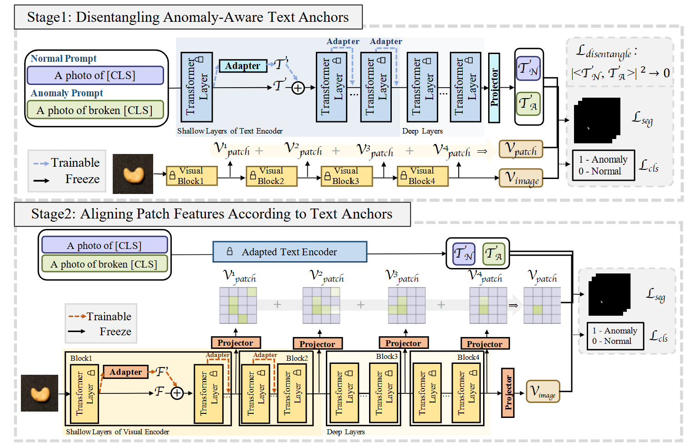

# TODO:
**@卓林**
- 把表填完，目前还缺实验数据
- 写Segmentation Decoder的实验分析, 由于缺少实验数据, 目前尚未填写

## Summary of AA-CLIP
We choose [AA-CLIP](https://arxiv.org/pdf/2503.06661) as the baseline for our project. The following is a summary of the paper. We first introduce the anomaly detection problem, and then describe the AA-CLIP method and its experimental results.
#### Anomaly Detection
The paper targets zero-shot anomaly detection (both image-level classification and pixel-level localization) using CLIP, motivated by the observation that standard CLIP is “anomaly-unaware”: textual descriptions of normal and abnormal conditions tend to be embedded too closely, which weakens the contrast needed to distinguish anomalies, especially when transferring to unseen categories and across domains such as industrial inspection and medical imaging.
#### Method Summary
AA-CLIP introduces a lightweight, two-stage adaptation strategy with residual adapters. In Stage 1, the visual encoder is frozen while shallow layers of the text encoder are equipped with adapters to learn anomaly-aware text anchors (normal vs. anomaly), trained with alignment losses and a disentanglement (orthogonality) loss to explicitly separate normal and anomalous text embeddings. In Stage 2, the adapted text encoder is frozen and adapters are added to shallow layers of the visual encoder, aligning multi-granularity patch features (from multiple transformer layers) to the fixed text anchors, improving localization. This staged design avoids the representation collapse observed with one-stage joint adaptation and preserves zero-shot generalization.
#### Results
Across a broad set of industrial and medical benchmarks, AA-CLIP achieves state-of-the-art or near–state-of-the-art AUROC at both image and pixel levels, with particularly strong gains on challenging medical datasets. The method is also data-efficient, maintaining strong performance with very few training samples per class. Ablation studies show that residual adapters, staged training, and the disentanglement loss are all critical, while removing them degrades both detection accuracy and localization quality.

**Figure 1: The Pipeline of AA-CLIP.**

## Experimental Results
Following the baseline settings, we train our model on VisA, a visual anomaly detection dataset for industrial inspection, and evaluate it on multiple anomaly detection datasets across both industrial and medical domains. We adopt the Area Under the Receiver Operating Characteristic Curve (AUROC) as the evaluation metric at both pixel and image levels, where higher values indicate better anomaly detection performance. We evaluate three proposed modifications to the original method. The results are reported in Tables 1 and 2.

**Table 1: Pixel-level AUROC of the baseline and our method on industrial and medical domains.** We report both the original paper results and our reproduced results, which show slight differences. Our method comprises three composable components: (1) base text anchor, (2) cross-attention–gated features, and (3) segment decoder.
|Method   -----------   Dataset| Paper | Reproduction | (1) | (2) | (3) | (1) + (2) + (3) |
|:---|:---:|:---:|:---:|:---:|:---:|:---:|
|BTAD|97.0| 97.27|96.90|97.44|
|MPDD|96.7|96.54|96.28|96.28|
|MVTec-AD|91.9|91.43|91.95|92.29|
|Brain MRI|95.5|94.95|95.40|96.44|
|Liver CT|97.8|97.51|97.69|97.57|
|Retina OCT|95.5|95.80|96.15|96.31|
|ColonDB|84.0|83.63|84.01|83.94|
|ClinicDB|89.9|90.43|90.10|89.57|
|Kvasir|87.2|87.64|87.82|87.19|
|CVC-300|96.4|96.35|96.22|97.02|

**Table 2: Image-level AUROC of the baseline and our method on industrial and medical domains.** We report both the original paper results and our reproduced results, which show slight differences. Our method comprises three composable components: (1) base text anchor, (2) cross-attention–gated features, and (3) segment decoder.
|Method   -----------   Dataset| Paper | Reproduction | (1) | (2) | (3) | (1) + (2) + (3) |
|:---|:---:|:---:|:---:|:---:|:---:|:---:|
|BTAD|94.8|94.98|95.33|94.66|
|MPDD|75.1|74.25|76.55|74.90|
|MVTec-AD|90.5|89.78|89.10|90.45|
|Brain MRI|80.2|77.18|79.37|83.41|
|Liver CT|69.7|65.63|63.73|65.6|
|Retina OCT|82.7|83.22|84.17|85.44|

**Base Text Anchor.** We introduce an additional base text anchor—specifically, the frozen text embedding from the original CLIP model—to refine the disentanglement loss proposed in the original paper. However, no noticeable improvement or degradation is observed in either pixel-level or image-level AUROC. We attribute this to the fact that, in high-dimensional spaces, orthogonality is a relatively weak constraint. Consequently, whether we enforce the normal and anomalous text embeddings to be orthogonal to each other, or instead minimize the inner product between their offsets with respect to a fixed base embedding, the impact on the training dynamics is limited. Both approaches preserve the same property of disentangling text embeddings to facilitate anomaly detection, which likely explains the similar performance.

**Cross-Attention–Gated Features.** We introduce a cross attention module to gate the image's patch features. We assume that the text embedding also provide the information to guide which region of images should be focused on. The results shows that, although most dataset keep the same, the BraWe introduce a cross-attention module to gate the image patch features, based on the assumption that text embeddings can provide guidance on which image regions should be attended to. The results show that, although performance on most datasets remains unchanged, the image-level AUROC on the Brain MRI and Liver CT datasets is improved. We hypothesize that certain textual descriptions contain richer information about the expected appearance of the images; therefore, injecting text information via cross-attention helps better discriminate between normal and anomalous images in these cases. However, the exact underlying mechanism remains unclear.in MR and Liver CT's image-level AUROC is improved. We guess that it is because some word contains more information about how the image should look like, so when we introduce the text information via cross attention, it can descriminate between normal and anomal image better, but the exact reason is still unknown. 

**Segmentation Decoder.** 

## Author Contributions

Ziye Huang implemented the base text anchor and cross-attention gating module and performed the corresponding experiments. 

Zhuolin Yu implemented the segmentation decoder, integrated all proposed techniques, and performed the corresponding experiments.

